# World Cup 2019
An Android application of the World Cup 2019 Cricket Tournament!  
During the Internship as a Software Developer at [KPSOFTWARESOLUTIONS](https://kpsoftwaresolutions.org/) I developed this Amazing Android project. 
This project is my first project that was published on PlayStore.😇 
I used **Firebase Database** in this application to update the point table. 
I put some unique features on this project to make it different from any other project. 
 You can find this project on PlayStore. 
Link:- [https://play.google.com/store/apps/details?id=org.kpsoftwaresolutions.iccwc&hl=en&gl=US](https://play.google.com/store/apps/details?id=org.kpsoftwaresolutions.iccwc&hl=en&gl=US)
  Here are some features of the project: 
1. History of all the previous tournaments with visualization. 
2. Match Fixture of the upcoming (World Cup 2019) cricket tournament. 
3. List of all qualified teams for the upcoming tournament. 
4. Details of each team with the phone of each player. 
5. Dynamic Point table.
 
Here are some screenshots of the project:  
Splash Screen:  
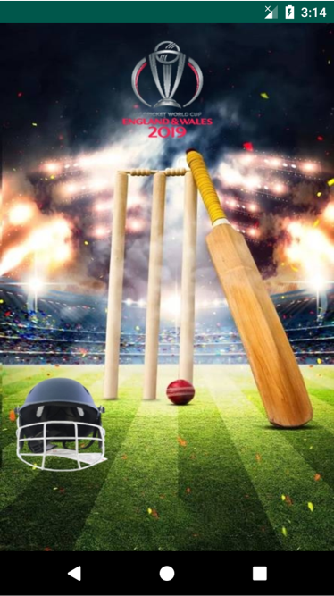
Home Page: 
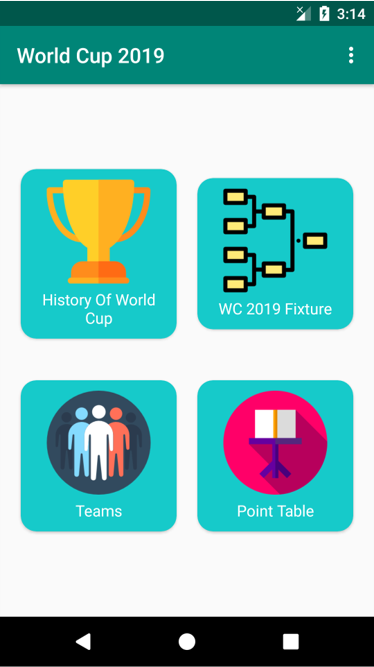
List of Previous World Cup Tournaments: 
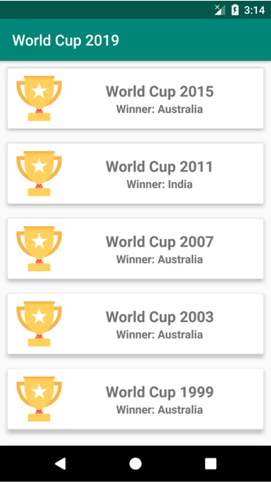
Details of Previous World Cup Tournament (2015): 
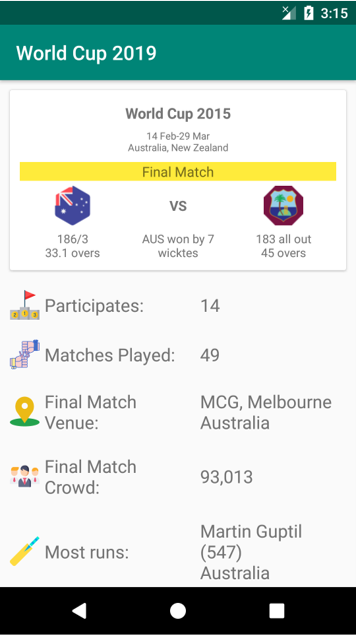
Fixture Page: 
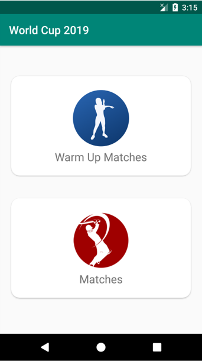
List of All Warm Up Matches: 
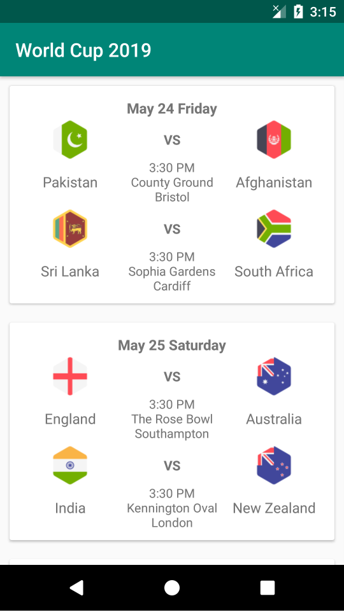
List of All Normal Matches: 
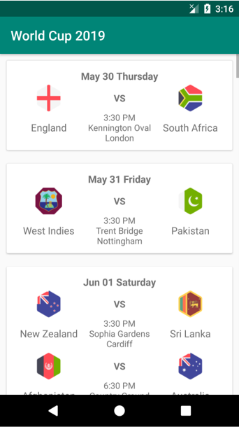
List of Qualified Teams: 
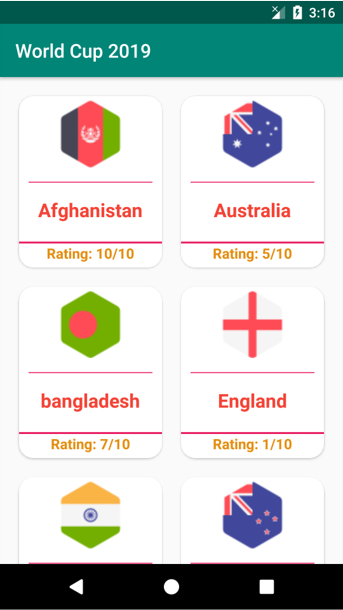
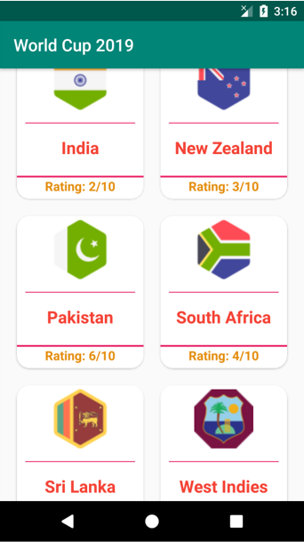
Details of a Qualified Team (BAN): 
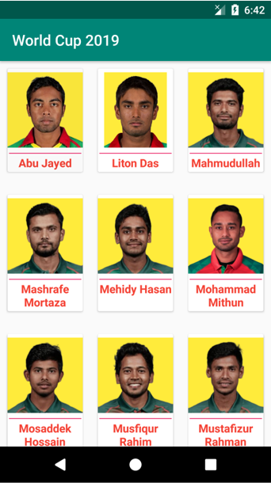
Exit Alert: 
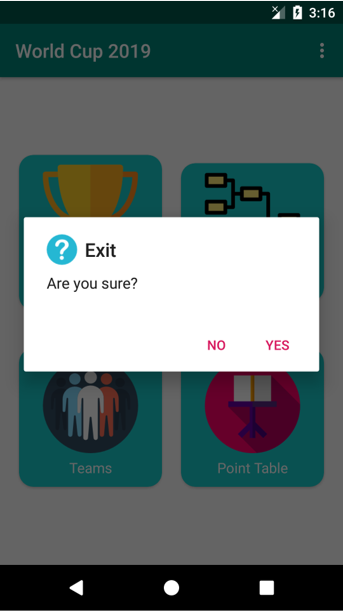
 
[N:B: Due to the maintenance issue The project has been removed from the PlayStore. Only the source code is available here.!]
